# Dash — Cross-Platform Monitoring Dashboard

> Comprehensive specification for a self-contained Electron application that displays dynamic dashboards, monitors sensors, evaluates alert rules, and dispatches notifications across macOS, Linux, and Windows.

---

## Table of Contents

1. [Architecture Overview](#1-architecture-overview)
2. [Technology Stack](#2-technology-stack)
3. [User Stories](#3-user-stories)
4. [Entity CRUD Descriptions](#4-entity-crud-descriptions)
5. [Workflow Diagrams](#5-workflow-diagrams)
6. [UX/Usability Design](#6-uxusability-design)
7. [ASCII Wireframes](#7-ascii-wireframes)
8. [E2E Testing Strategy](#8-e2e-testing-strategy)
9. [Packaging & Distribution](#9-packaging--distribution)

---

## 1. Architecture Overview

### 1.1 High-Level Architecture

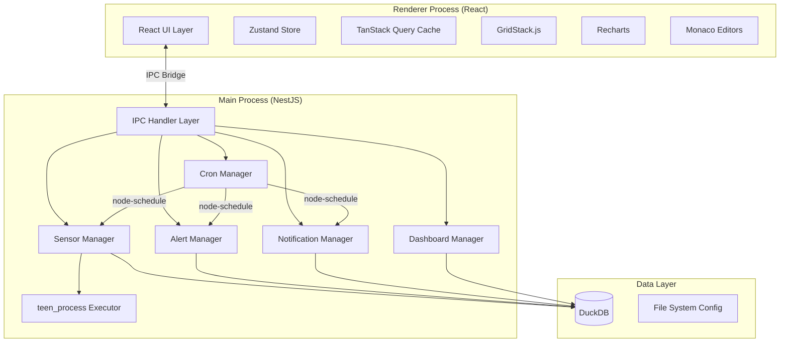

### 1.2 Process Model

| Process | Responsibility | Framework |
|---------|---------------|-----------|
| **Main** | Business logic, data access, cron scheduling, process execution | NestJS (standalone) |
| **Renderer** | UI rendering, state management, user interaction | React + Zustand + TanStack Query |
| **Child** | Sensor script execution (TS, bash, Docker, PowerShell) | teen_process |

### 1.3 Data Layer — DuckDB ER Diagram

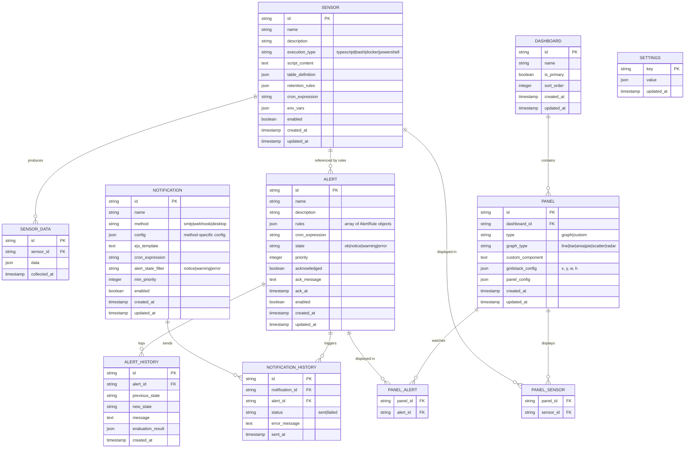

### 1.4 IPC Communication Pattern

All renderer-to-main communication flows through typed IPC channels. The main process exposes NestJS service methods via `ipcMain.handle` and pushes real-time updates via `webContents.send`.

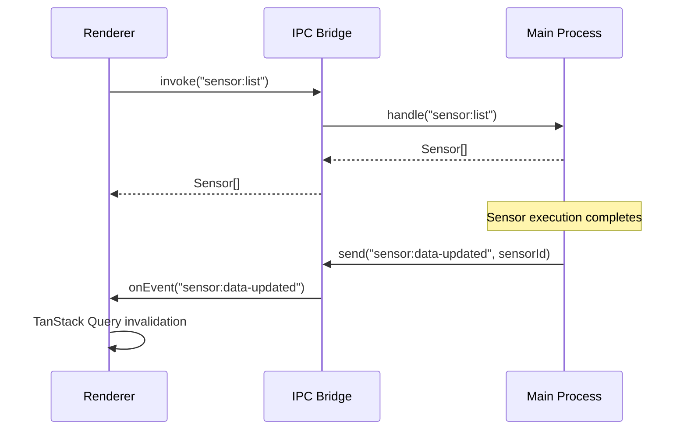

### 1.5 State Management

| Layer | Tool | Scope |
|-------|------|-------|
| Server state | TanStack Query | API data caching, background refetch, optimistic updates |
| Client state | Zustand | UI state (sidebar, edit mode, theme, active dashboard) |
| Persistent config | DuckDB `settings` table | App settings, persisted across sessions |
| Transient state | Cron Manager (in-memory) | Running task registry, schedule state |

---

## 2. Technology Stack

| Category | Library | Version | Purpose |
|----------|---------|---------|---------|
| Runtime | Electron | 35 | Cross-platform desktop shell |
| UI Framework | React | 19 | Component-based UI |
| Language | TypeScript | 5.8 | Type-safe development |
| State (server) | @tanstack/react-query | 5 | Async state, caching, invalidation |
| State (client) | Zustand | 5 | Lightweight client state |
| Backend Framework | @nestjs/core | 11 | Modular main-process services |
| Database | DuckDB (duckdb-node) | 1.2 | Embedded analytics database |
| Grid Layout | GridStack.js | 10 | Drag-and-drop dashboard panels |
| Charts | Recharts | 2.15 | React-native chart components |
| Virtualization | react-virtualized | 9 | Efficient list/table rendering |
| Code Editor | Monaco Editor | 0.52 | Script/query editing |
| Process Exec | teen_process | 2 | Cross-platform child process management |
| Scheduling | node-schedule | 2 | Cron expression scheduling |
| Templating | EJS | 3 | Notification templates |
| CSS | Tailwind CSS | 4 | Utility-first styling |
| Component Library | shadcn/ui | latest | Accessible, themeable components |
| Package Manager | pnpm | 10 | Fast, disk-efficient package management |
| Testing | Playwright | 1.50 | E2E testing for Electron |
| Build | electron-builder | 25 | Packaging and distribution |

---

## 3. User Stories

### 3.1 Dashboards (10 stories)

| ID | Story | Acceptance Criteria |
|----|-------|-------------------|
| D-01 | As a user, I want to see a dashboard immediately on app launch so that I can monitor systems without extra clicks. | The primary dashboard renders within 2s of app ready. |
| D-02 | As a user, I want to create multiple dashboards so that I can organize monitoring by domain. | "New Dashboard" action creates a named dashboard and navigates to it. |
| D-03 | As a user, I want to set one dashboard as primary so that it loads by default on startup. | Setting a dashboard as primary unsets any previous primary. |
| D-04 | As a user, I want to rename a dashboard so that I can keep names meaningful as my setup evolves. | Inline rename saves on blur/enter and is reflected in the sidebar. |
| D-05 | As a user, I want to delete a dashboard so that I can remove outdated views. | Delete prompts confirmation; deleting the primary dashboard selects the next available. |
| D-06 | As a user, I want to reorder dashboards in the sidebar so that the most important ones are at the top. | Drag-and-drop reorder persists `sort_order`. |
| D-07 | As a user, I want to enter edit mode on a dashboard so that I can rearrange and configure panels. | An "Edit" toggle enables GridStack drag/resize and shows per-panel toolbars. |
| D-08 | As a user, I want to exit edit mode and auto-save layout changes so that my arrangement persists. | Exiting edit mode writes `gridstack_config` for all modified panels. |
| D-09 | As a user, I want panels to fill the full available screen so that no space is wasted. | Dashboard content area uses 100% of viewport minus sidebar and header. |
| D-10 | As a user, I want the dashboard to refresh automatically when sensor data arrives so that I see live data. | IPC `sensor:data-updated` events trigger TanStack Query cache invalidation. |

### 3.2 Panels (8 stories)

| ID | Story | Acceptance Criteria |
|----|-------|-------------------|
| P-01 | As a user, I want to add a panel to a dashboard so that I can visualize data. | "Add Panel" inserts a panel with default size at the next available grid position. |
| P-02 | As a user, I want to choose between graph and custom panel types so that I can use built-in charts or write my own component. | Panel creation offers "Graph" and "Custom" type selection. |
| P-03 | As a user, I want to map one or more sensors to a panel so that it displays their data. | Multi-select sensor picker writes `panel_sensor` associations. |
| P-04 | As a user, I want to select a Recharts graph type (line, bar, area, pie, scatter, radar) for graph panels so that I can pick the best visualization. | Graph type dropdown maps directly to Recharts component types. |
| P-05 | As a user, I want to write a custom React component in Monaco for custom panels so that I have full flexibility. | Monaco editor with JSX/TSX support; component receives sensor data via props. |
| P-06 | As a user, I want to associate alerts with a panel so that alert state is visible on the dashboard. | Alert multi-select picker writes `panel_alert` associations. |
| P-07 | As a user, I want the panel border to change color when an associated alert fires so that I can spot issues at a glance. | Border color maps: ok→default, notice→blue, warning→amber, error→red. |
| P-08 | As a user, I want a panel alert icon that navigates to the alerts page filtered to the triggered alerts so that I can investigate quickly. | Icon badge shows count; clicking navigates to `/alerts?ids=...`. |

### 3.3 Sensors (12 stories)

| ID | Story | Acceptance Criteria |
|----|-------|-------------------|
| S-01 | As a user, I want to create a sensor with a name, description, and execution type so that I can collect data. | Form validates required fields; saves to `sensor` table. |
| S-02 | As a user, I want to choose TypeScript as an execution type so that I can write type-safe collection scripts. | TS scripts are transpiled and executed in a sandboxed context. |
| S-03 | As a user, I want to choose Bash as an execution type (with JSON output) so that I can use shell scripts on Linux/macOS/WSL. | Bash unavailable on Windows unless WSL is configured in settings. |
| S-04 | As a user, I want to choose Docker as an execution type so that I can run containerized data collection. | Container runs, stdout is parsed as JSON, container is removed after execution. |
| S-05 | As a user, I want to choose PowerShell as an execution type (Windows only) so that I can collect Windows-specific metrics. | PowerShell option hidden on non-Windows platforms. |
| S-06 | As a user, I want to define a JSON selector so that I can extract specific fields from script output. | JSONPath-style selector applied to parsed output before storage. |
| S-07 | As a user, I want to define table definitions for sensor data so that the schema is explicit. | Table definition JSON specifies column names, types, and constraints. |
| S-08 | As a user, I want to set retention rules so that old data is automatically purged. | Retention rules specify max age and/or max rows; enforced by a maintenance cron. |
| S-09 | As a user, I want to assign a cron expression to a sensor so that collection runs on schedule. | Valid cron expression required; registered with node-schedule on save. |
| S-10 | As a user, I want to edit sensor scripts in Monaco so that I have a rich editing experience. | Monaco editor with language-appropriate syntax highlighting and intellisense. |
| S-11 | As a user, I want to set environment variables per sensor so that scripts can access secrets/config. | Key-value env var editor; vars passed to child process environment. |
| S-12 | As a user, I want to see a list of all sensors with their status so that I have an overview of data collection. | Virtualized list showing name, type, cron, last run, enabled/disabled. |

### 3.4 Alerts (12 stories)

| ID | Story | Acceptance Criteria |
|----|-------|-------------------|
| A-01 | As a user, I want to create an alert with name, description, and priority so that I can define monitoring rules. | Form validates required fields; priority is a positive integer. |
| A-02 | As a user, I want to define multiple DuckDB queries as alert data sources so that rules can evaluate complex conditions. | Array of query strings, each editable in Monaco with DuckDB SQL highlighting. |
| A-03 | As a user, I want to define structured rules that determine alert state so that alert logic is clear and maintainable. | Each rule targets a sensor column, applies an aggregation over a time window, compares against a threshold, and maps to a severity. |
| A-04 | As a user, I want to assign a cron expression to an alert so that evaluation runs on schedule. | Cron registered with node-schedule on save. |
| A-05 | As a user, I want to see the current state of each alert (ok, notice, warning, error) in a list so that I can triage issues. | Color-coded state badges in the alert list. |
| A-06 | As a user, I want to acknowledge an alert so that the team knows it is being handled. | "Acknowledge" action prompts for a message and sets `acknowledged=true`. |
| A-07 | As a user, I want to see alert history so that I can review state transitions over time. | History log shows timestamp, previous state, new state, and evaluation result. |
| A-08 | As a user, I want to associate sensors with an alert so that the relationship is explicit. | Sensor relationships are implicit through alert rule definitions. |
| A-09 | As a user, I want to filter alerts by state so that I can focus on active issues. | Filter dropdown with checkboxes for each state; persisted in URL params. |
| A-10 | As a user, I want to filter alerts by priority so that I can focus on critical issues first. | Sortable priority column and min-priority filter. |
| A-11 | As a user, I want alerts to be enabled/disabled so that I can pause evaluation without deleting. | Toggle switch per alert; disabled alerts skip cron execution. |
| A-12 | As a user, I want to clear an acknowledgement so that a previously handled alert can re-trigger notifications. | "Clear Ack" resets `acknowledged`, `ack_message`, and `ack_at`. |

### 3.5 Notifications (9 stories)

| ID | Story | Acceptance Criteria |
|----|-------|-------------------|
| N-01 | As a user, I want to create a notification rule with a delivery method (SMTP, webhook, desktop) so that I can be alerted through the right channel. | Method selection renders method-specific config fields. |
| N-02 | As a user, I want to configure SMTP settings (host, port, auth, from/to) so that email notifications work. | SMTP test send validates configuration. |
| N-03 | As a user, I want to configure webhook endpoints so that notifications post to external services. | Webhook URL, method (POST/PUT), headers, and body template. |
| N-04 | As a user, I want desktop notifications so that I can see alerts without leaving my workflow. | Electron `Notification` API; respects OS notification settings. |
| N-05 | As a user, I want to write EJS templates in Monaco so that I can customize notification content. | Template receives alert object and query results as variables. |
| N-06 | As a user, I want to assign a cron expression to a notification so that it checks for alerts on schedule. | Cron queries alerts matching state filter and min priority. |
| N-07 | As a user, I want to filter which alert states trigger a notification so that I control noise level. | Checkbox selection for notice, warning, error. |
| N-08 | As a user, I want to set a minimum priority for notifications so that only important alerts are sent. | Integer input; only alerts with `priority >= min_priority` are dispatched. |
| N-09 | As a user, I want to see notification history so that I can verify delivery. | History list showing alert name, method, status (sent/failed), timestamp, error if any. |

### 3.6 Cron Tasks (4 stories)

| ID | Story | Acceptance Criteria |
|----|-------|-------------------|
| C-01 | As a user, I want to see a list of all registered cron tasks so that I know what is scheduled. | List shows task name, type (sensor/alert/notification), cron expression, active state, last run time. |
| C-02 | As a user, I want to force-run a cron task so that I can test or trigger immediate execution. | "Run Now" button executes the task immediately outside the schedule. |
| C-03 | As a user, I want only one instance of a task type running at a time so that executions don't overlap. | If node-schedule fires while the same task is running, the new invocation is skipped and logged. |
| C-04 | As a user, I want to enable/disable individual cron tasks so that I can pause scheduling without editing the entity. | Toggle updates the in-memory schedule; disabled tasks are not registered with node-schedule. |

### 3.7 Settings (8 stories)

| ID | Story | Acceptance Criteria |
|----|-------|-------------------|
| ST-01 | As a user, I want to switch between light and dark mode so that I can match my preference. | Theme toggle in header; persisted in settings. |
| ST-02 | As a user, I want the app to detect system theme preference on first launch so that it matches my OS. | `prefers-color-scheme` media query sets initial theme. |
| ST-03 | As a user, I want to configure WSL instance on Windows so that bash sensors work. | Dropdown lists installed WSL distros; selection persisted in settings. |
| ST-04 | As a user, I want to configure webhook endpoints globally so that notifications can reference them. | List of named endpoints with URL, method, and default headers. |
| ST-05 | As a user, I want to enable/disable desktop notifications globally so that I can silence all desktop alerts. | Global toggle overrides per-notification desktop settings. |
| ST-06 | As a user, I want to configure SMTP settings globally so that email notifications can reference them. | Global SMTP config with host, port, auth, TLS, from address. |
| ST-07 | As a user, I want to configure minimize/system tray behavior so that the app stays accessible. | Options: minimize to tray, show tray icon, close to tray. |
| ST-08 | As a user, I want to set global environment variables so that all sensors inherit common config. | Key-value editor; global vars merged with sensor-specific vars (sensor wins on conflict). |

---

## 4. Entity CRUD Descriptions

### 4.1 Sensor

**Fields:**

| Field | Type | Required | Validation | Default |
|-------|------|----------|------------|---------|
| `id` | UUID | auto | — | `uuidv4()` |
| `name` | string | yes | 1–100 chars, unique | — |
| `description` | string | no | max 500 chars | `""` |
| `execution_type` | enum | yes | `typescript\|bash\|docker\|powershell` | — |
| `script_content` | text | yes | non-empty | — |
| `table_definition` | JSON | yes | array of `{ name: string, type: string, json_selector?: string }` | — |
| `retention_rules` | JSON | no | `{ max_age_days?, max_rows? }` | `{}` |
| `cron_expression` | string | yes | valid cron expression (5 or 6 fields) | — |
| `env_vars` | JSON | no | `{ key: value }` object | `{}` |
| `enabled` | boolean | yes | — | `true` |
| `created_at` | timestamp | auto | — | `now()` |
| `updated_at` | timestamp | auto | — | `now()` |

**Create:** Validate all fields → insert into `sensor` table → create `sensor_data` table per `table_definition` → register cron job if `enabled=true`.

**Read:** List all sensors (with optional filters on `execution_type`, `enabled`). Get single sensor by ID with last execution timestamp.

**Update:** Validate changed fields → update `sensor` row → if `table_definition` changed, migrate data table → if `cron_expression` changed, reschedule cron → update `updated_at`.

**Delete:** Cancel cron job → drop `sensor_data` records → remove alert rule references → remove `panel_sensor` associations → delete `sensor` row.

**Cascade:** Deleting a sensor removes all associated `sensor_data`, unlinks from alerts and panels but does not delete those entities.

---

### 4.2 Alert

**Fields:**

| Field | Type | Required | Validation | Default |
|-------|------|----------|------------|---------|
| `id` | UUID | auto | — | `uuidv4()` |
| `name` | string | yes | 1–100 chars, unique | — |
| `description` | string | no | max 500 chars | `""` |
| `rules` | JSON | yes | array of AlertRule objects (see below) | `[]` |
| `cron_expression` | string | yes | valid cron expression | — |
| `state` | enum | auto | `ok\|notice\|warning\|error` | `"ok"` |
| `priority` | integer | yes | 1–100 | — |
| `acknowledged` | boolean | auto | — | `false` |
| `ack_message` | text | no | max 1000 chars | `null` |
| `ack_at` | timestamp | auto | — | `null` |
| `enabled` | boolean | yes | — | `true` |
| `created_at` | timestamp | auto | — | `now()` |
| `updated_at` | timestamp | auto | — | `now()` |

**AlertRule sub-fields:**

| Field | Type | Description |
|-------|------|-------------|
| `sensor_id` | UUID FK | Target sensor |
| `column` | string | Column from sensor's `table_definition` |
| `aggregation` | enum | `avg\|min\|max\|sum\|count\|last` |
| `time_window_minutes` | integer | Lookback window in minutes |
| `operator` | enum | `>\|>=\|<\|<=\|==\|!=` |
| `threshold` | number | Comparison value |
| `severity` | enum | `notice\|warning\|error` — severity when rule triggers |

> **Note:** Sensor relationships are implicit through rule definitions. The `alert_sensor` junction table is no longer used.

**Create:** Validate fields → insert into `alert` table with `rules` JSON → register cron job if `enabled=true`.

**Read:** List with filters on `state`, `priority`, `acknowledged`, `enabled`. Single alert includes rules and recent history.

**Update:** Validate → update row (including `rules` JSON) → reschedule cron if expression changed.

**Delete:** Cancel cron job → delete `alert_history` records → remove `panel_alert` links → remove `notification_history` referencing this alert → delete `alert` row.

**Cascade:** Deleting an alert removes all its history, unlinks from panels, and notification history.

---

### 4.3 Alert History

**Fields:**

| Field | Type | Required | Default |
|-------|------|----------|---------|
| `id` | UUID | auto | `uuidv4()` |
| `alert_id` | UUID FK | yes | — |
| `previous_state` | enum | yes | — |
| `new_state` | enum | yes | — |
| `message` | text | no | `null` |
| `evaluation_result` | JSON | no | `null` |
| `created_at` | timestamp | auto | `now()` |

**Create:** Inserted automatically when alert evaluation detects a state change (no manual creation).

**Read:** List by `alert_id` with pagination, ordered by `created_at` desc.

**Update:** Immutable — no updates allowed.

**Delete:** Only via parent alert deletion or retention-based cleanup.

---

### 4.4 Notification

**Fields:**

| Field | Type | Required | Validation | Default |
|-------|------|----------|------------|---------|
| `id` | UUID | auto | — | `uuidv4()` |
| `name` | string | yes | 1–100 chars, unique | — |
| `method` | enum | yes | `smtp\|webhook\|desktop` | — |
| `config` | JSON | yes | method-specific schema | — |
| `ejs_template` | text | yes | valid EJS syntax | — |
| `cron_expression` | string | yes | valid cron expression | — |
| `alert_state_filter` | enum | yes | `notice\|warning\|error` | `"error"` |
| `min_priority` | integer | yes | 1–100 | `1` |
| `enabled` | boolean | yes | — | `true` |
| `created_at` | timestamp | auto | — | `now()` |
| `updated_at` | timestamp | auto | — | `now()` |

**Config schemas by method:**

- **SMTP:** `{ host, port, secure, auth: { user, pass }, from, to: string[] }`
- **Webhook:** `{ url, method, headers: {}, bodyTemplate? }`
- **Desktop:** `{ }` (uses Electron Notification API with global settings)

**Create:** Validate fields and method-specific config → insert → register cron.

**Read:** List with filters on `method`, `enabled`. Single notification includes recent dispatch history.

**Update:** Validate → update row → reschedule cron if expression changed.

**Delete:** Cancel cron → delete `notification_history` → delete `notification` row.

---

### 4.5 Dashboard

**Fields:**

| Field | Type | Required | Validation | Default |
|-------|------|----------|------------|---------|
| `id` | UUID | auto | — | `uuidv4()` |
| `name` | string | yes | 1–80 chars, unique | — |
| `is_primary` | boolean | yes | only one true at a time | `false` |
| `sort_order` | integer | auto | — | `max + 1` |
| `created_at` | timestamp | auto | — | `now()` |
| `updated_at` | timestamp | auto | — | `now()` |

**Create:** Validate name → if `is_primary=true`, unset current primary → insert.

**Read:** List ordered by `sort_order`. Single dashboard includes all panels with their configs.

**Update:** Validate → if setting as primary, unset current → update row.

**Delete:** Confirm via dialog → delete all child panels (cascade) → if was primary, set next dashboard as primary → delete row.

**Cascade:** Deleting a dashboard deletes all its panels and their sensor/alert associations.

---

### 4.6 Panel

**Fields:**

| Field | Type | Required | Validation | Default |
|-------|------|----------|------------|---------|
| `id` | UUID | auto | — | `uuidv4()` |
| `dashboard_id` | UUID FK | yes | valid dashboard | — |
| `type` | enum | yes | `graph\|custom` | — |
| `graph_type` | enum | conditional | required if type=graph; `line\|bar\|area\|pie\|scatter\|radar` | `null` |
| `custom_component` | text | conditional | required if type=custom; valid JSX | `null` |
| `gridstack_config` | JSON | yes | `{ x, y, w, h, minW?, minH? }` | `{ x:0, y:0, w:4, h:3 }` |
| `panel_config` | JSON | no | type-specific options | `{}` |
| `created_at` | timestamp | auto | — | `now()` |
| `updated_at` | timestamp | auto | — | `now()` |

**Create:** Validate → insert → create sensor/alert associations.

**Read:** Always fetched as part of parent dashboard. Includes resolved sensor data and alert states.

**Update:** Validate → update row → update `gridstack_config` on layout change → re-link sensors/alerts if changed.

**Delete:** Remove `panel_sensor` links → remove `panel_alert` links → delete `panel` row.

---

### 4.7 Cron Tasks (In-Memory)

Cron tasks are not persisted as their own table — they are derived from sensors, alerts, and notifications. The Cron Manager maintains an in-memory registry.

**Registry Entry:**

| Field | Type | Description |
|-------|------|-------------|
| `id` | string | Source entity ID |
| `type` | enum | `sensor\|alert\|notification` |
| `cron_expression` | string | Schedule |
| `job` | ScheduledJob | node-schedule reference |
| `running` | boolean | Whether currently executing |
| `last_run` | timestamp | Last execution time |
| `enabled` | boolean | Active state |

**Concurrency rule:** Before executing, check `running === true`. If true, skip and log. Set `running = true` at start, `false` at completion (in `finally` block).

---

### 4.8 Settings

**Fields:**

| Key | Type | Description | Default |
|-----|------|-------------|---------|
| `theme` | `"light"\|"dark"\|"system"` | UI theme | `"system"` |
| `wsl_distro` | `string\|null` | WSL distribution name (Windows only) | `null` |
| `global_env_vars` | `{ key: value }` | Environment variables for all sensors | `{}` |
| `smtp_config` | JSON | Global SMTP configuration | `null` |
| `webhook_endpoints` | JSON array | Named webhook endpoints | `[]` |
| `desktop_notifications_enabled` | boolean | Global desktop notification toggle | `true` |
| `minimize_to_tray` | boolean | Minimize to system tray | `false` |
| `show_tray_icon` | boolean | Show system tray icon | `true` |
| `close_to_tray` | boolean | Close button minimizes to tray | `false` |

**CRUD:** Key-value store pattern — `get(key)`, `set(key, value)`, `getAll()`. No delete (keys have defaults).

---

## 5. Workflow Diagrams

### 5.1 Sensor Execution Flow

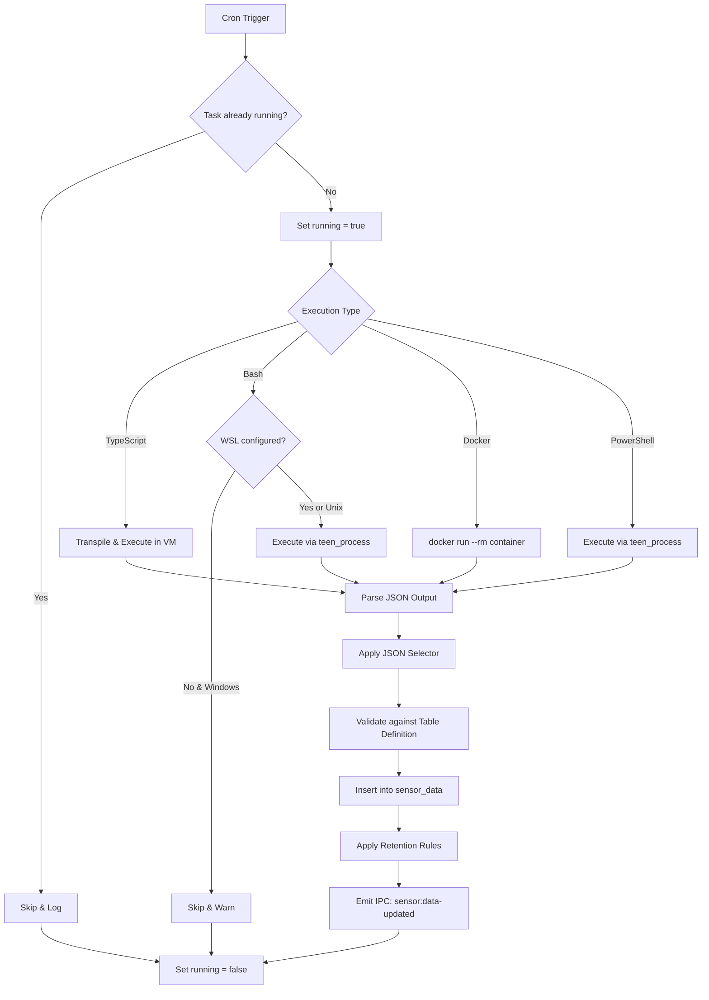

### 5.2 Alert Evaluation Flow

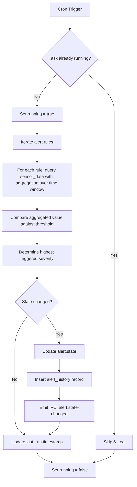

### 5.3 Notification Dispatch Flow

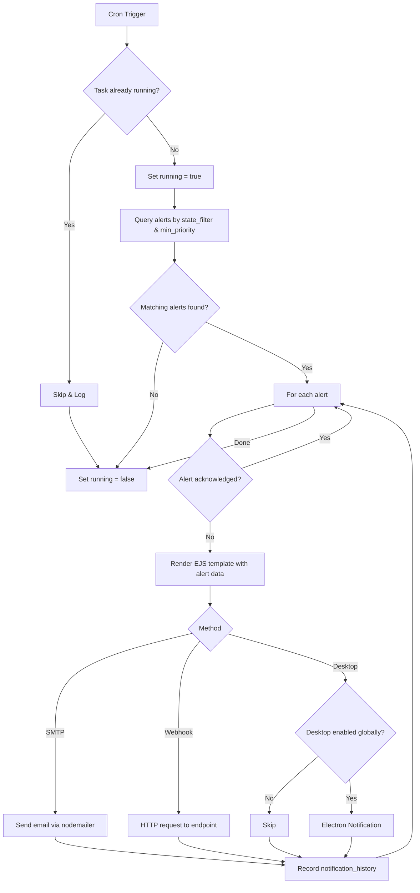

### 5.4 Dashboard Rendering Flow

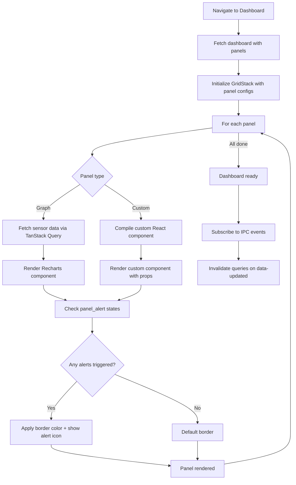

### 5.5 Cron Task Lifecycle

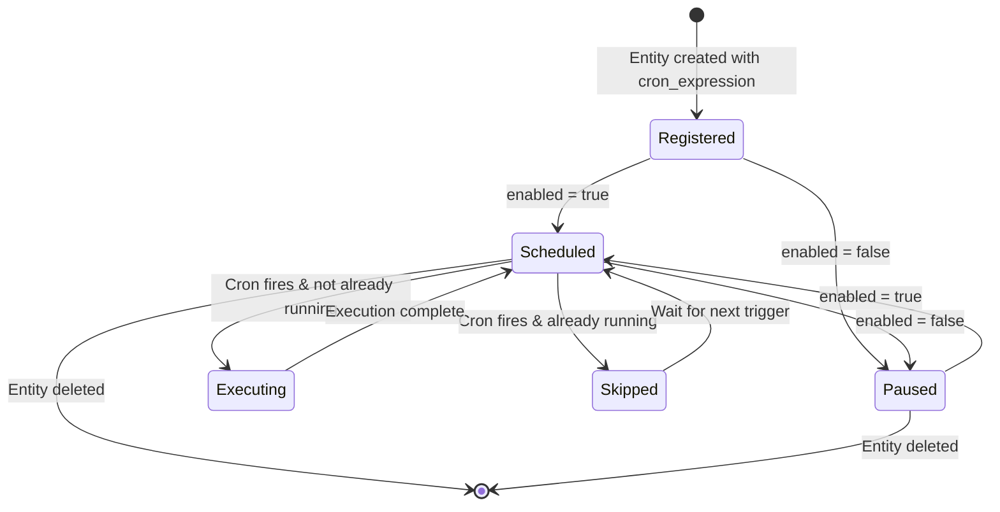

### 5.6 IPC Channel Map

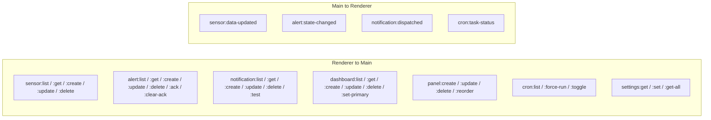

### 5.7 App Startup Sequence

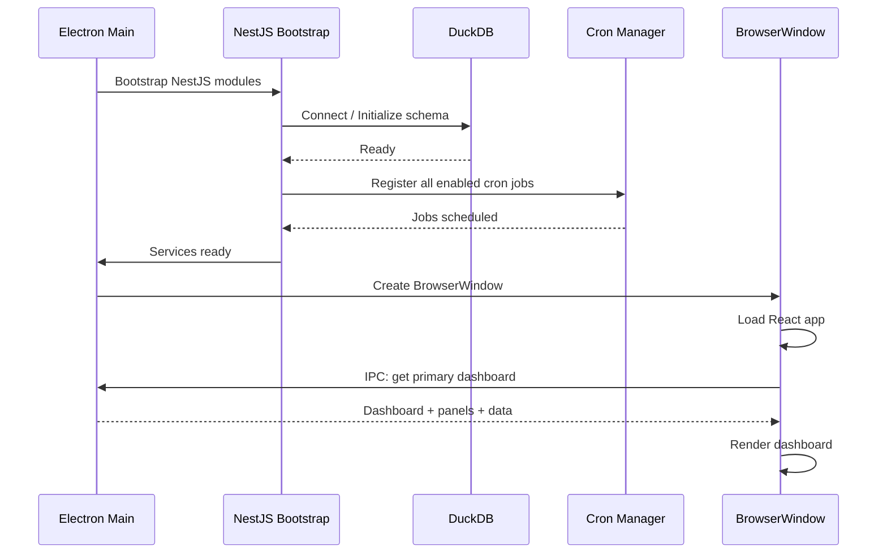

### 5.8 Acknowledgement Flow

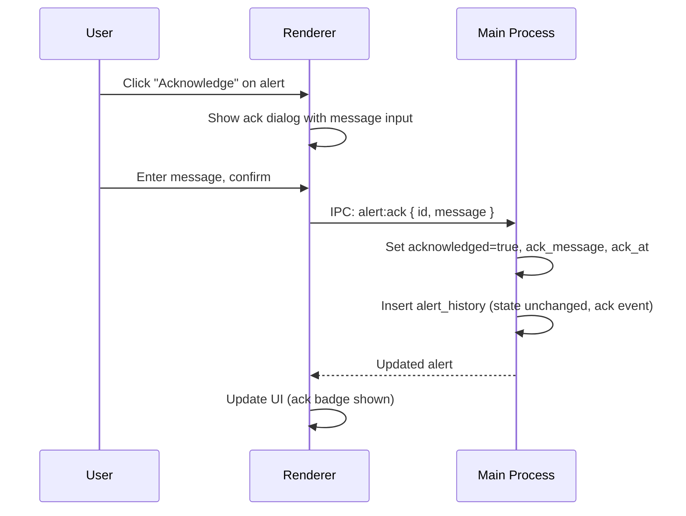

### 5.9 Panel Edit Mode Flow

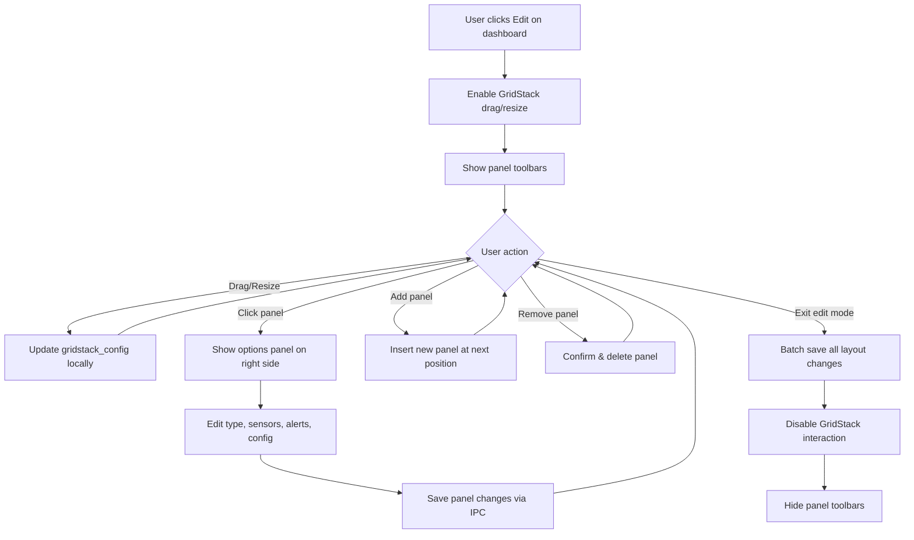

### 5.10 Data Retention Flow

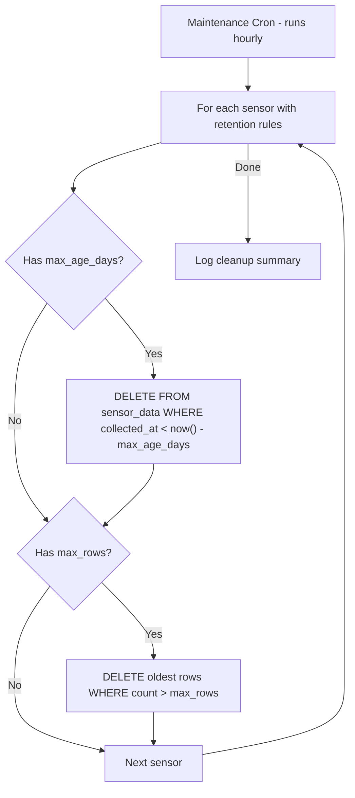

### 5.11 CI/CD Pipeline

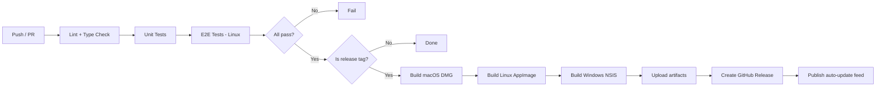

---

## 6. UX/Usability Design

### 6.1 Nielsen's Heuristics Applied

| Heuristic | Application |
|-----------|------------|
| **Visibility of system status** | Cron task running indicators, sensor last-run timestamps, alert state badges, notification delivery status. Real-time IPC updates keep the UI current. |
| **Match between system and real world** | Domain terminology: "sensors" collect data, "alerts" evaluate conditions, "notifications" deliver messages. Cron expressions shown with human-readable descriptions. |
| **User control and freedom** | Edit mode is explicitly toggled (not always-on). Delete actions require confirmation. Alert acknowledgement can be cleared. Undo not required — all actions are deliberate CRUD. |
| **Consistency and standards** | shadcn/ui components throughout. Consistent form layout: fields on left, actions on bottom. Lists use the same column pattern (name, status, last run, actions). |
| **Error prevention** | Cron expression validation with preview of next runs. Form validation before save. Confirmation dialogs on destructive actions. Sensor type restrictions based on platform. |
| **Recognition over recall** | Sidebar navigation with icons and labels. Dashboard tabs for quick switching. Alert state color coding consistent everywhere (panels, list, badges). |
| **Flexibility and efficiency** | Force-run for cron tasks. Keyboard shortcuts for common actions. Monaco editor for power users. Bulk actions in list views. |
| **Aesthetic and minimalist design** | Admin layout with collapsible sidebar. Dashboard panels use full available space. Edit mode overlays only appear when needed. Options panel slides in from right. |
| **Help users recognize, diagnose, recover from errors** | Sensor execution errors shown inline with script output. Notification failures show error details in history. Alert evaluation errors captured in history with full result. |
| **Help and documentation** | Tooltip hints on form fields. Cron expression helper with common presets. Monaco editor with language-appropriate syntax help. |

### 6.2 Accessibility (WCAG 2.1 AA)

| Requirement | Implementation |
|-------------|---------------|
| Color contrast | shadcn/ui default theme meets 4.5:1 ratio. Alert colors supplemented with icons (not color alone). |
| Keyboard navigation | All interactive elements focusable. Tab order follows visual layout. GridStack panels keyboard-accessible in edit mode. |
| Screen readers | ARIA labels on icon buttons. Live regions for alert state changes. Form field labels linked to inputs. |
| Reduced motion | `prefers-reduced-motion` disables chart animations and panel transitions. |
| Focus management | Focus trapped in modals. Focus returned to trigger on dialog close. |

### 6.3 Theme System

| Theme | Source | Behavior |
|-------|--------|----------|
| Light | Tailwind + shadcn light tokens | Default for `prefers-color-scheme: light` |
| Dark | Tailwind + shadcn dark tokens | Default for `prefers-color-scheme: dark` |
| System | OS detection | Follows OS preference, updates on change |

Theme toggle in the app header. Selection persisted to `settings.theme`. CSS variables scoped to `:root` / `.dark` class on `<html>`.

### 6.4 Information Architecture

```
App
├── Dashboards (default view)
│   ├── [Dashboard 1] (tabs or sidebar sub-items)
│   ├── [Dashboard 2]
│   └── + New Dashboard
├── Sensors
│   ├── Sensor List
│   └── Sensor Form (create/edit)
├── Alerts
│   ├── Alert List (filterable by state, priority)
│   ├── Alert Form (create/edit)
│   └── Alert History (per alert)
├── Notifications
│   ├── Notification List
│   ├── Notification Form (create/edit)
│   └── Notification History
├── Cron Tasks
│   └── Task List (read-only with actions)
└── Settings
    ├── General (theme, tray, minimize)
    ├── Environment Variables
    ├── SMTP Configuration
    ├── Webhook Endpoints
    └── Platform (WSL config on Windows)
```

### 6.5 Responsive Layout

The app targets desktop Electron windows. Minimum supported size: **1024×768**.

| Breakpoint | Behavior |
|-----------|----------|
| < 1024px width | Sidebar collapses to icon-only mode |
| ≥ 1024px | Sidebar shows icons + labels |
| Panel edit mode | Right options panel takes 320px; dashboard area adjusts |

---

## 7. ASCII Wireframes

### 7.1 Main Layout Shell

```
┌─────────────────────────────────────────────────────────┐
│  ☰  Dash                          🌙 Light/Dark    ─ □ ✕│
├────────┬────────────────────────────────────────────────┤
│        │                                                │
│  🏠    │                                                │
│  Dash  │                                                │
│        │                                                │
│  📊    │              Main Content Area                 │
│ Sensors│          (routed by sidebar selection)          │
│        │                                                │
│  🔔    │                                                │
│ Alerts │                                                │
│        │                                                │
│  📨    │                                                │
│ Notif  │                                                │
│        │                                                │
│  ⏰    │                                                │
│  Cron  │                                                │
│        │                                                │
│  ⚙️    │                                                │
│ Settngs│                                                │
│        │                                                │
├────────┴────────────────────────────────────────────────┤
│  Status Bar: 3 sensors running | 1 alert active         │
└─────────────────────────────────────────────────────────┘
```

### 7.2 Dashboard View (Normal Mode)

```
┌────────┬────────────────────────────────────────────────┐
│Sidebar │  Dashboard: Production    [Tab2] [Tab3]  [Edit]│
│        ├────────────────────┬───────────────────────────┤
│        │                    │                           │
│        │   CPU Usage (Line) │   Memory Usage (Area)     │
│        │   ┌──────────┐    │   ┌──────────────┐        │
│        │   │  /\  /\  │    │   │ ████████     │        │
│        │   │ /  \/  \ │    │   │ ██████████   │        │
│        │   │/        \│    │   │ ████████████ │        │
│        │   └──────────┘    │   └──────────────┘        │
│        │                    │                  ⚠ [!]    │
│        ├────────────────────┴───────────────────────────┤
│        │                                                │
│        │   Disk I/O (Bar)                               │
│        │   ┌──────────────────────────────────────┐     │
│        │   │ ██ ██ ██ ██ ██ ██ ██ ██ ██ ██ ██ ██ │     │
│        │   └──────────────────────────────────────┘     │
│        │                                                │
└────────┴────────────────────────────────────────────────┘
  Panel with ⚠ border = alert triggered; [!] icon links to alerts
```

### 7.3 Dashboard View (Edit Mode)

```
┌────────┬──────────────────────────────────┬─────────────┐
│Sidebar │  Dashboard: Production    [Done] │ Panel Opts  │
│        ├──────────────────────────────────┤             │
│        │                                  │ Type: Graph │
│        │   ┌─ CPU Usage ── [⋮] ─┐        │ Chart: Line │
│        │   │  (drag handle)     │        │             │
│        │   │  /\  /\            │        │ Sensors:    │
│        │   │ /  \/  \           │        │ [x] cpu_pct │
│        │   │                    │ resize │ [ ] mem_pct │
│        │   └──────────────── ◢──┘ handle │             │
│        │                                  │ Alerts:     │
│        │   ┌─ Memory ─── [⋮] ──┐         │ [x] cpu_hi  │
│        │   │                    │         │             │
│        │   │                    │         │ Config:     │
│        │   └──────────────── ◢──┘         │ Y-Axis: %   │
│        │                                  │ Color: blue │
│        │   [+ Add Panel]                  │             │
└────────┴──────────────────────────────────┴─────────────┘
  Click a panel to show its options on the right side
```

### 7.4 Sensor List

```
┌────────┬────────────────────────────────────────────────┐
│Sidebar │  Sensors                          [+ New Sensor]│
│        ├────────────────────────────────────────────────┤
│        │ ┌──────────────────────────────────────────┐   │
│        │ │ Name          Type    Cron       Status   │   │
│        │ ├──────────────────────────────────────────┤   │
│        │ │ CPU Monitor   TS      */5 * * *  ● Active │   │
│        │ │ Disk Usage    Bash    0 * * * *  ● Active │   │
│        │ │ Docker Stats  Docker  */10 * * * ○ Paused │   │
│        │ │ Win Perf      PS      */5 * * *  ● Active │   │
│        │ │ Network IO    TS      * * * * *  ● Active │   │
│        │ │ ...                                       │   │
│        │ └──────────────────────────────────────────┘   │
│        │                                                │
│        │  Showing 1-20 of 45 sensors                    │
└────────┴────────────────────────────────────────────────┘
  Virtualized list for performance with large sensor counts
```

### 7.5 Sensor Form (Create/Edit)

```
┌────────┬────────────────────────────────────────────────┐
│Sidebar │  Sensor: CPU Monitor                    [Save] │
│        ├────────────────────────────────────────────────┤
│        │                                                │
│        │  Name: [CPU Monitor                        ]   │
│        │  Description: [Collects CPU usage metrics   ]  │
│        │                                                │
│        │  Execution Type: [ TypeScript     ▼]           │
│        │  Cron Expression: [*/5 * * * *    ] (every 5m) │
│        │                                                │
│        │  Script:                                       │
│        │  ┌──────────────── Monaco Editor ─────────────┐│
│        │  │ export default async function(): Promise {  ││
│        │  │   const cpu = await getCpuUsage();          ││
│        │  │   return { pct: cpu.percentage };           ││
│        │  │ }                                           ││
│        │  └────────────────────────────────────────────┘│
│        │                                                │
│        │  JSON Selector: [$.pct                      ]  │
│        │  Table Definition: [{name, type}... ]          │
│        │                                                │
│        │  Retention: Max Age [30] days  Max Rows [10000]│
│        │                                                │
│        │  Environment Variables:                        │
│        │  [API_KEY    ] = [***************] [✕]         │
│        │  [+ Add Variable]                              │
│        │                                                │
│        │  [Cancel]                            [Save]    │
└────────┴────────────────────────────────────────────────┘
```

### 7.6 Alert List

```
┌────────┬────────────────────────────────────────────────┐
│Sidebar │  Alerts                           [+ New Alert]│
│        ├────────────────────────────────────────────────┤
│        │  Filters: State [All ▼]  Priority [All ▼]      │
│        │ ┌──────────────────────────────────────────┐   │
│        │ │ Name           State    Pri  Ack  Actions│   │
│        │ ├──────────────────────────────────────────┤   │
│        │ │ High CPU       🔴 Error   1   ✕   [Ack] │   │
│        │ │ Disk Space     🟡 Warn    2   ✕   [Ack] │   │
│        │ │ Memory Leak    🔵 Notice  3   ✓   [Clr] │   │
│        │ │ API Latency    🟢 OK      2   ─   [─]   │   │
│        │ │ Docker Health  🟢 OK      1   ─   [─]   │   │
│        │ │ ...                                      │   │
│        │ └──────────────────────────────────────────┘   │
│        │                                                │
│        │  [View History]                                 │
└────────┴────────────────────────────────────────────────┘
```

### 7.7 Alert Form (Create/Edit)

```
┌────────┬────────────────────────────────────────────────┐
│Sidebar │  Alert: High CPU                        [Save] │
│        ├────────────────────────────────────────────────┤
│        │                                                │
│        │  Name: [High CPU                           ]   │
│        │  Description: [Fires when CPU > 90% for 5m ]   │
│        │  Priority: [1  ]  Enabled: [✓]                 │
│        │  Cron: [*/1 * * * *     ] (every minute)       │
│        │                                                │
│        │  DuckDB Queries:                               │
│        │  Query 1:                                      │
│        │  ┌──────────── Monaco (SQL) ─────────────────┐ │
│        │  │ SELECT avg(pct) as avg_cpu                 │ │
│        │  │ FROM cpu_monitor_data                      │ │
│        │  │ WHERE collected_at > now() - INTERVAL 5 MIN│ │
│        │  └───────────────────────────────────────────┘ │
│        │  [+ Add Query]                                 │
│        │                                                │
│        │  Evaluation Script:                            │
│        │  ┌──────────── Monaco (TS) ──────────────────┐ │
│        │  │ export default function(results) {         │ │
│        │  │   if (results[0].avg_cpu > 90) return "error"│
│        │  │   if (results[0].avg_cpu > 75) return "warn" │
│        │  │   return "ok";                              │ │
│        │  └───────────────────────────────────────────┘ │
│        │                                                │
│        │  Associated Sensors: [CPU Monitor ✕] [+]       │
│        │                                                │
│        │  [Cancel]                            [Save]    │
└────────┴────────────────────────────────────────────────┘
```

### 7.8 Alert Acknowledgement Dialog

```
        ┌────────────────────────────────────┐
        │  Acknowledge Alert: High CPU       │
        │                                    │
        │  Current State: 🔴 Error           │
        │  Since: 2026-03-01 14:23:00        │
        │                                    │
        │  Message:                          │
        │  ┌────────────────────────────────┐│
        │  │ Investigating - scaling up     ││
        │  │ web servers to handle traffic  ││
        │  │                                ││
        │  └────────────────────────────────┘│
        │                                    │
        │  [Cancel]           [Acknowledge]  │
        └────────────────────────────────────┘
```

### 7.9 Notification List

```
┌────────┬────────────────────────────────────────────────┐
│Sidebar │  Notifications                   [+ New Notif] │
│        ├────────────────────────────────────────────────┤
│        │ ┌──────────────────────────────────────────┐   │
│        │ │ Name           Method   Cron      Enabled│   │
│        │ ├──────────────────────────────────────────┤   │
│        │ │ Ops Email      SMTP     */15 * * * ✓    │   │
│        │ │ Slack Hook     Webhook  */5 * * *  ✓    │   │
│        │ │ Desktop Alert  Desktop  * * * * *  ✓    │   │
│        │ │ PagerDuty      Webhook  */1 * * *  ○    │   │
│        │ └──────────────────────────────────────────┘   │
│        │                                                │
│        │  [View Dispatch History]                        │
└────────┴────────────────────────────────────────────────┘
```

### 7.10 Notification Form (Create/Edit)

```
┌────────┬────────────────────────────────────────────────┐
│Sidebar │  Notification: Ops Email                [Save] │
│        ├────────────────────────────────────────────────┤
│        │                                                │
│        │  Name: [Ops Email                          ]   │
│        │  Method: [ SMTP          ▼]                    │
│        │  Cron: [*/15 * * * *    ] (every 15 min)       │
│        │  Enabled: [✓]                                  │
│        │                                                │
│        │  Alert Filters:                                │
│        │  States: [✓] Error  [✓] Warning  [ ] Notice    │
│        │  Min Priority: [1  ]                           │
│        │                                                │
│        │  SMTP Config:  (or [Use Global Config])        │
│        │  Host: [smtp.example.com] Port: [587]          │
│        │  User: [ops@example.com ] Pass: [****]         │
│        │  From: [dash@example.com] To: [ops@example.com]│
│        │                                                │
│        │  EJS Template:                                 │
│        │  ┌──────────── Monaco (EJS) ─────────────────┐ │
│        │  │ Alert: <%= alert.name %>                   │ │
│        │  │ State: <%= alert.state %>                  │ │
│        │  │ Priority: <%= alert.priority %>             │ │
│        │  │ Time: <%= new Date().toISOString() %>       │ │
│        │  └───────────────────────────────────────────┘ │
│        │                                                │
│        │  [Test Send]  [Cancel]               [Save]    │
└────────┴────────────────────────────────────────────────┘
```

### 7.11 Cron Task List

```
┌────────┬────────────────────────────────────────────────┐
│Sidebar │  Cron Tasks                                    │
│        ├────────────────────────────────────────────────┤
│        │ ┌──────────────────────────────────────────┐   │
│        │ │ Task           Type    Cron     Last Run  │   │
│        │ ├──────────────────────────────────────────┤   │
│        │ │ CPU Monitor    Sensor  */5 * *  14:25:00 │   │
│        │ │   ● Active  [Run Now]  [Disable]         │   │
│        │ │                                          │   │
│        │ │ Disk Usage     Sensor  0 * * *  14:00:00 │   │
│        │ │   ● Active  [Run Now]  [Disable]         │   │
│        │ │                                          │   │
│        │ │ High CPU Check Alert   */1 * *  14:25:30 │   │
│        │ │   ● Active  [Run Now]  [Disable]         │   │
│        │ │                                          │   │
│        │ │ Ops Email      Notif   */15 * * 14:15:00 │   │
│        │ │   ● Active  [Run Now]  [Disable]         │   │
│        │ │                                          │   │
│        │ │ Docker Stats   Sensor  */10 * * ─        │   │
│        │ │   ○ Paused  [Run Now]  [Enable]          │   │
│        │ │                                          │   │
│        │ │ Retention      System  0 * * *  14:00:00 │   │
│        │ │   ● Active  ─          ─                 │   │
│        │ └──────────────────────────────────────────┘   │
└────────┴────────────────────────────────────────────────┘
  Note: Tasks are in-memory only; derived from entity cron configs
```

### 7.12 Settings Page

```
┌────────┬────────────────────────────────────────────────┐
│Sidebar │  Settings                                      │
│        ├────────────────────────────────────────────────┤
│        │                                                │
│        │  General                                       │
│        │  ──────                                        │
│        │  Theme: ( ) Light  (●) Dark  ( ) System        │
│        │  Minimize to tray: [✓]                         │
│        │  Show tray icon: [✓]                           │
│        │  Close to tray: [ ]                            │
│        │                                                │
│        │  Platform (Windows)                            │
│        │  ─────────────────                             │
│        │  WSL Distribution: [ Ubuntu-22.04       ▼]     │
│        │                                                │
│        │  Notifications                                 │
│        │  ─────────────                                 │
│        │  Desktop notifications: [✓] Enabled            │
│        │                                                │
│        │  Global SMTP                                   │
│        │  ───────────                                   │
│        │  Host: [smtp.example.com]  Port: [587  ]       │
│        │  User: [user@example.com]  Pass: [*****]       │
│        │  From: [dash@example.com]  TLS: [✓]            │
│        │  [Test Connection]                             │
│        │                                                │
│        │  Webhook Endpoints                             │
│        │  ─────────────────                             │
│        │  [Slack] https://hooks.slack.com/...   [✕]     │
│        │  [PagerDuty] https://events.pd.com/... [✕]     │
│        │  [+ Add Endpoint]                              │
│        │                                                │
│        │  Global Environment Variables                  │
│        │  ────────────────────────────                  │
│        │  [APP_ENV    ] = [production     ] [✕]         │
│        │  [API_BASE   ] = [https://api... ] [✕]         │
│        │  [+ Add Variable]                              │
│        │                                                │
│        │                                       [Save]   │
└────────┴────────────────────────────────────────────────┘
```

---

## 8. E2E Testing Strategy

### 8.1 Framework

**Playwright for Electron** — uses `electron.launch()` to drive the app with full Chromium DevTools protocol support.

### 8.2 Page Object Model

```
tests/
├── fixtures/
│   └── app.fixture.ts          # Electron app launch/teardown
├── pages/
│   ├── sidebar.page.ts
│   ├── dashboard.page.ts
│   ├── sensor-list.page.ts
│   ├── sensor-form.page.ts
│   ├── alert-list.page.ts
│   ├── alert-form.page.ts
│   ├── notification-list.page.ts
│   ├── notification-form.page.ts
│   ├── cron-list.page.ts
│   └── settings.page.ts
├── suites/
│   ├── dashboard.spec.ts
│   ├── sensor.spec.ts
│   ├── alert.spec.ts
│   ├── notification.spec.ts
│   ├── cron.spec.ts
│   └── settings.spec.ts
└── helpers/
    ├── db.helper.ts            # DuckDB seed/reset
    └── ipc.helper.ts           # IPC event simulation
```

### 8.3 Test Suites

#### Dashboard Suite

| Test | Description |
|------|------------|
| loads primary dashboard on startup | App opens with the primary dashboard rendered and panels visible. |
| creates a new dashboard | New dashboard appears in sidebar and is navigable. |
| sets dashboard as primary | Primary badge moves; app restarts to the new primary. |
| deletes a dashboard | Dashboard removed from sidebar; panels cleaned up. |
| enters and exits edit mode | GridStack enables; panels become draggable; exit saves layout. |
| adds a panel in edit mode | New panel appears at default position with type selector. |
| removes a panel in edit mode | Panel removed after confirmation dialog. |
| resizes a panel | Drag corner handle; verify `gridstack_config` updated. |
| panel alert border color | Create alert in error state; panel border turns red. |
| auto-refresh on sensor data | Simulate IPC event; verify chart data updates without reload. |

#### Sensor Suite

| Test | Description |
|------|------------|
| creates a TypeScript sensor | Form submits; sensor appears in list; cron job registered. |
| validates required fields | Submit with empty name shows validation error. |
| edits sensor script | Modify script in Monaco; save; verify persisted content. |
| deletes sensor with cascade | Delete sensor; verify sensor_data removed, panel/alert unlinked. |
| hides bash on Windows without WSL | On Windows without WSL config, bash option not shown. |
| shows PowerShell only on Windows | PowerShell option hidden on macOS/Linux. |
| sets environment variables | Add key-value pair; verify passed to executed process. |
| force runs sensor cron | Click "Run Now"; verify new data appears in sensor_data. |

#### Alert Suite

| Test | Description |
|------|------------|
| creates an alert with queries | Form submits with DuckDB queries; cron registered. |
| evaluation changes state | Trigger evaluation; verify state transition and history log. |
| acknowledge dialog | Click ack; enter message; verify acknowledged flag and message. |
| clear acknowledgement | Clear ack; verify fields reset. |
| filters by state | Select "Error" filter; only error alerts shown. |
| filters by priority | Sort by priority; verify order. |
| alert history pagination | Navigate history pages; verify correct records per page. |

#### Notification Suite

| Test | Description |
|------|------------|
| creates SMTP notification | Form submits with SMTP config; cron registered. |
| creates webhook notification | Form submits with webhook URL; cron registered. |
| test send | Click "Test Send"; verify dispatch attempt and history record. |
| dispatches on matching alerts | Trigger alert in error state; run notification cron; verify sent. |
| skips acknowledged alerts | Acknowledged alert not included in notification dispatch. |
| notification history shows status | History list shows sent/failed with error message if failed. |

#### Cron Suite

| Test | Description |
|------|------------|
| lists all registered tasks | All sensor/alert/notification crons appear in task list. |
| force run task | Click "Run Now"; verify execution and last_run update. |
| prevents overlapping execution | Start long-running task; trigger again; verify skip log. |
| toggle enable/disable | Disable task; verify removed from schedule; re-enable; verify registered. |

#### Settings Suite

| Test | Description |
|------|------------|
| theme switch | Toggle dark mode; verify CSS class on html element. |
| system theme detection | Set to "system"; mock OS preference; verify match. |
| WSL configuration | Select distro; verify bash sensor option becomes available. |
| global SMTP test | Enter SMTP config; click test; verify connection attempt. |
| global env vars | Add env var; create sensor; verify var available in sensor execution. |
| tray settings | Enable minimize to tray; close window; verify app still running. |

### 8.4 Platform Matrix

| Platform | Runner | Notes |
|----------|--------|-------|
| macOS (arm64) | GitHub Actions macos-latest | Full test suite |
| Linux (x64) | GitHub Actions ubuntu-latest | Full test suite + headless |
| Windows (x64) | GitHub Actions windows-latest | Full test suite + WSL tests |

### 8.5 Performance Benchmarks

| Metric | Target | Measurement |
|--------|--------|------------|
| App startup to dashboard | < 2s | Playwright timer from launch to first panel render |
| Sensor list with 1000 items | < 500ms render | Virtualized list scroll performance |
| Dashboard with 20 panels | < 1s render | Time from navigation to all panels painted |
| DuckDB query (1M rows) | < 200ms | Timed query execution in sensor evaluation |
| IPC round-trip | < 50ms | Invoke to response measurement |

---

## 9. Packaging & Distribution

### 9.1 electron-builder Configuration

```yaml
appId: com.dash.app
productName: Dash
directories:
  output: dist
  buildResources: build

files:
  - "dist-main/**/*"
  - "dist-renderer/**/*"
  - "node_modules/**/*"
  - "!node_modules/**/test/**"
  - "!node_modules/**/*.md"

extraResources:
  - from: "node_modules/duckdb/lib/binding"
    to: "duckdb-binding"
    filter: ["*.node"]

mac:
  category: public.app-category.utilities
  target:
    - target: dmg
      arch: [x64, arm64]
  hardenedRuntime: true
  entitlements: build/entitlements.mac.plist
  notarize: true

linux:
  target:
    - target: AppImage
      arch: [x64, arm64]
    - target: deb
      arch: [x64]
  category: Utility

win:
  target:
    - target: nsis
      arch: [x64]
  certificateFile: ${WIN_CSC_LINK}
  certificatePassword: ${WIN_CSC_KEY_PASSWORD}

nsis:
  oneClick: false
  allowToChangeInstallationDirectory: true
  createDesktopShortcut: true

publish:
  provider: github
  releaseType: release
```

### 9.2 DuckDB Native Bundling

DuckDB ships platform-specific native bindings (`.node` files). The build pipeline must:

1. Run `pnpm install` on each target platform (or use `@duckdb/duckdb-wasm` for cross-compilation)
2. Copy the correct binding to `extraResources/duckdb-binding/`
3. At runtime, resolve the binding path relative to `process.resourcesPath`
4. Mark `duckdb` as an Electron rebuild target in `package.json`:

```json
{
  "build": {
    "nodeGypRebuild": false,
    "npmRebuild": true
  }
}
```

### 9.3 Auto-Update

```typescript
// Main process — auto-updater setup
import { autoUpdater } from 'electron-updater';

autoUpdater.autoDownload = true;
autoUpdater.autoInstallOnAppQuit = true;

autoUpdater.on('update-available', (info) => {
  mainWindow.webContents.send('update:available', info.version);
});

autoUpdater.on('update-downloaded', () => {
  mainWindow.webContents.send('update:ready');
});

// Check on startup and every 4 hours
autoUpdater.checkForUpdates();
setInterval(() => autoUpdater.checkForUpdates(), 4 * 60 * 60 * 1000);
```

### 9.4 CI/CD Pipeline (GitHub Actions)

```yaml
name: Build & Release

on:
  push:
    branches: [main]
    tags: ['v*']
  pull_request:
    branches: [main]

jobs:
  lint-and-test:
    runs-on: ubuntu-latest
    steps:
      - uses: actions/checkout@v4
      - uses: pnpm/action-setup@v4
      - uses: actions/setup-node@v4
        with: { node-version: 22 }
      - run: pnpm install --frozen-lockfile
      - run: pnpm lint
      - run: pnpm typecheck
      - run: pnpm test:unit

  e2e:
    needs: lint-and-test
    strategy:
      matrix:
        os: [ubuntu-latest, macos-latest, windows-latest]
    runs-on: ${{ matrix.os }}
    steps:
      - uses: actions/checkout@v4
      - uses: pnpm/action-setup@v4
      - uses: actions/setup-node@v4
        with: { node-version: 22 }
      - run: pnpm install --frozen-lockfile
      - run: pnpm test:e2e

  release:
    if: startsWith(github.ref, 'refs/tags/v')
    needs: e2e
    strategy:
      matrix:
        include:
          - os: macos-latest
            platform: mac
          - os: ubuntu-latest
            platform: linux
          - os: windows-latest
            platform: win
    runs-on: ${{ matrix.os }}
    steps:
      - uses: actions/checkout@v4
      - uses: pnpm/action-setup@v4
      - uses: actions/setup-node@v4
        with: { node-version: 22 }
      - run: pnpm install --frozen-lockfile
      - run: pnpm build
      - run: pnpm electron-builder --${{ matrix.platform }} --publish always
        env:
          GH_TOKEN: ${{ secrets.GITHUB_TOKEN }}
          WIN_CSC_LINK: ${{ secrets.WIN_CSC_LINK }}
          WIN_CSC_KEY_PASSWORD: ${{ secrets.WIN_CSC_KEY_PASSWORD }}
          APPLE_ID: ${{ secrets.APPLE_ID }}
          APPLE_APP_SPECIFIC_PASSWORD: ${{ secrets.APPLE_APP_SPECIFIC_PASSWORD }}
```

### 9.5 Semantic Versioning

The project follows [Semantic Versioning 2.0](https://semver.org/):

| Bump | When |
|------|------|
| **Major** | Breaking changes to data schema, IPC contracts, or settings format |
| **Minor** | New features (sensors types, chart types, notification methods) |
| **Patch** | Bug fixes, performance improvements, dependency updates |

Release tags use the format `v{major}.{minor}.{patch}` (e.g., `v1.0.0`). Pre-releases use `-beta.N` suffix for testing auto-update channels.

---

*This specification is the implementation blueprint for the Dash monitoring dashboard. All features, data models, workflows, and UX decisions documented here should be treated as the source of truth for development.*
